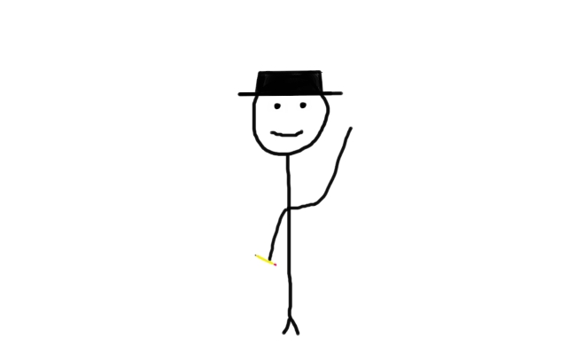

محمد صلاح الدين بعيو مدوّن و مبرمج ليبي الجنسيه من مواليد مدينة دوسيلدورف طالب بكلية الهندسة الكهربائيه بجامعة طرابلس و مطور تطبيقات سطح المكتب و تاجر مخدرات   
مهتم بلعب الشطرنج على chess.com و قراءة الروايات البوليسية والصينية و المانجا 

أميل حاليا الى التدوين و مبادرات تطوير المحتوى العربي عن طريق كتابة المقالات الهادفه في مجال البرمجي و المجالات العامة الأخرى  

<ul>
    <li>1. أجيد برمجة الواجهات الامامية </li>
    <li>اتعامل مع vue.js framework</li>
    <li>و مبرمج لبعض المنظومات التجارية مستخدما NET.  و visual studio</li>
</ul>  
  

يمنكم التواصل معي على بريدي الالكتروني 
msdbgx@gmail.com

او متابعتي  على 

[الفيسبوك](https://www.facebook.com/medo.bayou)

[التويتر](https://twitter.com/medobaayou)

[حسوبi/o](https://io.hsoub.com/u/medo-baayou)

